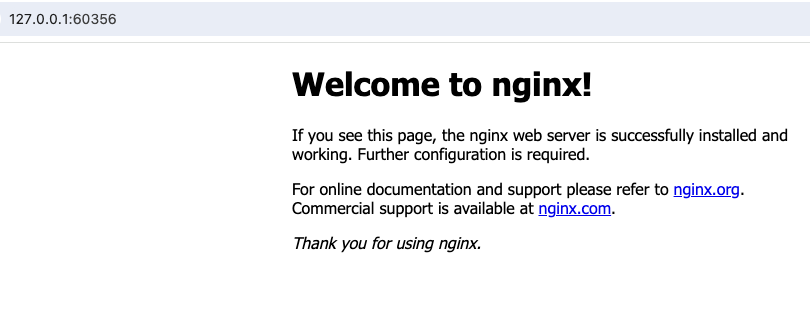

# app-operator

Deploy nginx service.
In your RC, you can specific how many replicas you need for the nginx services.

## Description

The project shows how we deleveop one app-operator to contrl our nginx service and
how we build and enjoy it on our cluster.

## Getting Started

### Prerequisites

- go version v1.22.0+
- docker version 17.03+.
- kubectl version v1.11.3+.
- Access to a Kubernetes v1.11.3+ cluster.

### How we develop the operator

**1. check the development environment**

```sh
docker version # 27.1.1 & API version: 1.46
go version #  go1.22.0 darwin/amd64
kubectl version --short # Client Version: v1.27.2 & Kustomize Version: v5.0.1
minikube version # v1.33.1
```

**2. create one project**

- mkdir dirs and `kubebuilder init` the project

```sh
mkdir MyOperatorProject
cd MyOperatorProject
mkdir app-operator
cd app-operator
kubebuilder init --domain=wlin.cn \
--repo=github.com/testcara/app-operator \
--owner cara
```

- analyze the current generated project files

```sh
carawang@carawangs-MacBook-Pro app-operator % tree
.
├── Dockerfile
├── Makefile # make cmds for build, deploy, test...
├── PROJECT # Kubebuilder related metadata including projectName, repo, version...
├── README.md
├── cmd
│   └── main.go # include the basic dependency and logics for Manager, Controller and Webhook...
├── config # config files for operator deplopyment
│   ├── default
│   │   ├── kustomization.yaml
│   │   ├── manager_metrics_patch.yaml
│   │   └── metrics_service.yaml
│   ├── manager
│   │   ├── kustomization.yaml
│   │   └── manager.yaml
│   ├── network-policy
│   │   ├── allow-metrics-traffic.yaml
│   │   └── kustomization.yaml
│   ├── prometheus
│   │   ├── kustomization.yaml
│   │   └── monitor.yaml
│   └── rbac
│       ├── kustomization.yaml
│       ├── leader_election_role.yaml
│       ├── leader_election_role_binding.yaml
│       ├── metrics_auth_role.yaml
│       ├── metrics_auth_role_binding.yaml
│       ├── metrics_reader_role.yaml
│       ├── role.yaml
│       ├── role_binding.yaml
│       └── service_account.yaml
├── go.mod
├── go.sum
├── hack
│   └── boilerplate.go.txt
└── test
    ├── e2e
    │   ├── e2e_suite_test.go
    │   └── e2e_test.go
    └── utils
        └── utils.go

12 directories, 29 files
```

**3. `kubebuilder create api`**

```sh
kubebuilder create api \
> --group apps --version v1 --kind App
```

and enter two 'y' to ensure it helps us to create resources and controllers

- analyze the generated files

```sh
carawang@carawangs-MacBook-Pro app-operator % tree
.
├── api
│   └── v1
│       ├── app_types.go # including Spec and Struct definition for our crd
│       ├── groupversion_info.go
│       └── zz_generated.deepcopy.go
├── bin
│   ├── controller-gen -> /Users/carawang/MyOperatorProject/app-operator/bin/controller-gen-v0.16.1
│   └── controller-gen-v0.16.1
├── config
│   ├── crd
│   │   ├── kustomization.yaml
│   │   └── kustomizeconfig.yaml
│   ├── rbac # resource permission files
│   │   ├── app_editor_role.yaml
│   │   ├── app_viewer_role.yaml
│   └── samples
│       ├── apps_v1_app.yaml # example cr files
│       └── kustomization.yaml
└── internal
    └── controller
       ├── app_controller.go # including the logic how we control our crd
       ├── app_controller_test.go
       └── suite_test.go
19 directories, 43 files
```

**4. Update the api and controller to meet our requirements**

- define our crd

I use the `git format-patch-1` to generate one patch to show our updates

```patch
From 2b82236523ce64b93904cd94e2cc0fe6ef139ac4 Mon Sep 17 00:00:00 2001
From: Cara Wang <wlin@redhat.com>
Date: Mon, 26 Aug 2024 12:08:33 +0800
Subject: [PATCH] define the our crd

---
 api/v1/app_types.go | 16 +++++++++++++++-
 1 file changed, 15 insertions(+), 1 deletion(-)

diff --git a/api/v1/app_types.go b/api/v1/app_types.go
index c9d2446..c6cad8c 100644
--- a/api/v1/app_types.go
+++ b/api/v1/app_types.go
@@ -17,6 +17,8 @@ limitations under the License.
 package v1
 
 import (
+	appsv1 "k8s.io/api/apps/v1"
+	corev1 "k8s.io/api/core/v1"
 	metav1 "k8s.io/apimachinery/pkg/apis/meta/v1"
 )
 
@@ -29,13 +31,25 @@ type AppSpec struct {
 	// Important: Run "make" to regenerate code after modifying this file
 
 	// Foo is an example field of App. Edit app_types.go to remove/update
-	Foo string `json:"foo,omitempty"`
+	// Foo string `json:"foo,omitempty"`
+	Deployment DeploymentTemplate `json:"deployment,omitempty"`
+	Service    ServiceTemplate    `json:"service,omitempty"`
+}
+
+type DeploymentTemplate struct {
+	appsv1.DeploymentSpec `json:",inline"`
+}
+
+type ServiceTemplate struct {
+	corev1.ServiceSpec `json:",inline"`
 }
 
 // AppStatus defines the observed state of App
 type AppStatus struct {
 	// INSERT ADDITIONAL STATUS FIELD - define observed state of cluster
 	// Important: Run "make" to regenerate code after modifying this file
+	Workflow appsv1.DeploymentStatus `json:"workflow"`
+	Network  corev1.ServiceStatus    `json:"network"`
 }
 
 // +kubebuilder:object:root=true
-- 
2.24.3 (Apple Git-128)
```

**5. update the controller**

We use 'git format-patch HEAD^' to generate the controller patch.

```patch
From 15ff29d28f789700c7ae6d58e2c97d51557a36c3 Mon Sep 17 00:00:00 2001
From: Cara Wang <wlin@redhat.com>
Date: Mon, 26 Aug 2024 14:44:58 +0800
Subject: [PATCH] update the controller

---
 internal/controller/app_controller.go | 156 +++++++++++++++++++++++++-
 1 file changed, 152 insertions(+), 4 deletions(-)

diff --git a/internal/controller/app_controller.go b/internal/controller/app_controller.go
index 893f21d..d153e65 100644
--- a/internal/controller/app_controller.go
+++ b/internal/controller/app_controller.go
@@ -18,13 +18,20 @@ package controller
 
 import (
 	"context"
+	"reflect"
+	"time"
 
+	"k8s.io/apimachinery/pkg/api/errors"
 	"k8s.io/apimachinery/pkg/runtime"
+	"k8s.io/apimachinery/pkg/types"
 	ctrl "sigs.k8s.io/controller-runtime"
 	"sigs.k8s.io/controller-runtime/pkg/client"
 	"sigs.k8s.io/controller-runtime/pkg/log"
 
-	appsv1 "github.com/testcara/app-operator/api/v1"
+	appsv1 "k8s.io/api/apps/v1" // always needed
+	corev1 "k8s.io/api/core/v1" // always needed
+
+	v1 "github.com/testcara/app-operator/api/v1"
 )
 
 // AppReconciler reconciles a App object
@@ -36,6 +43,10 @@ type AppReconciler struct {
 // +kubebuilder:rbac:groups=apps.wlin.cn,resources=apps,verbs=get;list;watch;create;update;patch;delete
 // +kubebuilder:rbac:groups=apps.wlin.cn,resources=apps/status,verbs=get;update;patch
 // +kubebuilder:rbac:groups=apps.wlin.cn,resources=apps/finalizers,verbs=update
+// +kubebuilder:rbac:groups=apps,resources=deployments,verbs=get;update;list;watch;create;patch;delete
+// +kubebuilder:rbac:groups=apps,resources=deployments/status, verbs=get
+// +kubebuilder:rbac:groups=core,resources=services,verbs=get;update;list;watch;create;patch;delete
+// +kubebuilder:rbac:groups=core,resources=services/status,verbs=get
 
 // Reconcile is part of the main kubernetes reconciliation loop which aims to
 // move the current state of the cluster closer to the desired state.
@@ -46,17 +57,154 @@ type AppReconciler struct {
 //
 // For more details, check Reconcile and its Result here:
 // - https://pkg.go.dev/sigs.k8s.io/controller-runtime@v0.19.0/pkg/reconcile
+var CounterReconcileApp int64
+
+const GenericRequestDuration = 100 * time.Minute
+
 func (r *AppReconciler) Reconcile(ctx context.Context, req ctrl.Request) (ctrl.Result, error) {
-	_ = log.FromContext(ctx)
+	<-time.NewTicker(100 * time.Microsecond).C
+	log := log.FromContext(ctx)
+
+	CounterReconcileApp += 1
+	log.Info("Starting a reconcile", "number", CounterReconcileApp)
 
-	// TODO(user): your logic here
+	app := &v1.App{}
+	if err := r.Get(ctx, req.NamespacedName, app); err != nil {
+		// when there is no App resource, return directly
+		if errors.IsNotFound((err)) {
+			log.Info("App not found")
+			return ctrl.Result{}, nil
+		}
+		// when there is the App resource, retry every duration
+		log.Error(err, "Failed to get the app, will request after a short time")
+		return ctrl.Result{RequeueAfter: GenericRequestDuration}, err
+	}
 
+	// reconcile sub-resources
+	var result ctrl.Result
+	var err error
+	result, err = r.reconcileDeployment(ctx, app)
+	if err != nil {
+		log.Error(err, "Failed to reconcile Deployment")
+		return result, err
+	}
+	result, err = r.reconcileService(ctx, app)
+	if err != nil {
+		log.Error(err, "Failed to reconcile Service")
+		return result, err
+	}
+
+	log.Info("All resources have been reconciled")
 	return ctrl.Result{}, nil
 }
 
+func (r *AppReconciler) reconcileDeployment(ctx context.Context, app *v1.App) (ctrl.Result, error) {
+	log := log.FromContext(ctx)
+
+	var dp = &appsv1.Deployment{}
+	// go to the specified namespace to check whether the exact deployment exists
+	err := r.Get(ctx, types.NamespacedName{
+		Namespace: app.Namespace,
+		Name:      app.Name,
+	}, dp)
+	// we get the deployment well
+	if err == nil {
+		log.Info("Deloyment has already exist")
+		// if the current status == expected status, return directly
+		if reflect.DeepEqual(dp.Status, app.Status.Workflow) {
+			return ctrl.Result{}, nil
+		}
+		// when current status != expected status, update it
+		app.Status.Workflow = dp.Status
+		if err := r.Status().Update(ctx, app); err != nil {
+			log.Error(err, "Failed to update App status")
+			return ctrl.Result{RequeueAfter: GenericRequestDuration}, err
+		}
+		log.Info("The App status has been updated")
+		return ctrl.Result{}, nil
+	}
+	// if there is no deployment, we create one
+	if errors.IsNotFound(err) {
+		newDp := &appsv1.Deployment{}
+		newDp.SetName(app.Name)
+		newDp.SetNamespace(app.Namespace)
+		newDp.SetLabels(app.Labels)
+		newDp.Spec = app.Spec.Deployment.DeploymentSpec
+		newDp.Spec.Template.SetLabels(app.Labels)
+
+		if err := ctrl.SetControllerReference(app, newDp, r.Scheme); err != nil {
+			log.Error(err, "Failed to SetControllerReference, will request after a short time")
+			return ctrl.Result{RequeueAfter: GenericRequestDuration}, err
+		}
+		if err := r.Create(ctx, newDp); err != nil {
+			log.Error(err, "Failed to create Deployment, will request after a short time")
+			return ctrl.Result{RequeueAfter: GenericRequestDuration}, err
+		}
+		log.Info("Deployment has been created")
+		return ctrl.Result{}, nil
+	} else {
+		// the deployment is there but we cannot get well
+		log.Error(err, "Failed to get Deployment, will request after a short time")
+		return ctrl.Result{RequeueAfter: GenericRequestDuration}, err
+	}
+
+}
+
+func (r *AppReconciler) reconcileService(ctx context.Context, app *v1.App) (ctrl.Result, error) {
+	log := log.FromContext(ctx)
+
+	var svc = &corev1.Service{}
+	// go to the specified namespace to check whether the exact Svc exists
+	err := r.Get(ctx, types.NamespacedName{
+		Namespace: app.Namespace,
+		Name:      app.Name,
+	}, svc)
+	// we get the service well
+	if err == nil {
+		log.Info("Service has already exist")
+		// if the current status == expected status, return directly
+		if reflect.DeepEqual(svc.Status, app.Status.Network) {
+			return ctrl.Result{}, nil
+		}
+		// when current status != expected status, update it
+		app.Status.Network = svc.Status
+		if err := r.Status().Update(ctx, app); err != nil {
+			log.Error(err, "Failed to update App status")
+			return ctrl.Result{RequeueAfter: GenericRequestDuration}, err
+		}
+		log.Info("The App status has been updated")
+		return ctrl.Result{}, nil
+	}
+	// if there is no deployment, we create one
+	if errors.IsNotFound(err) {
+		newSvc := &corev1.Service{}
+		newSvc.SetName(app.Name)
+		newSvc.SetNamespace(app.Namespace)
+		newSvc.SetLabels(app.Labels)
+		newSvc.Spec = app.Spec.Service.ServiceSpec
+		newSvc.Spec.Selector = app.Labels
+
+		if err := ctrl.SetControllerReference(app, newSvc, r.Scheme); err != nil {
+			log.Error(err, "Failed to SetControllerReference, will request after a short time")
+			return ctrl.Result{RequeueAfter: GenericRequestDuration}, err
+		}
+		if err := r.Create(ctx, newSvc); err != nil {
+			log.Error(err, "Failed to create Service, will request after a short time")
+			return ctrl.Result{RequeueAfter: GenericRequestDuration}, err
+		}
+		log.Info("Service has been created")
+		return ctrl.Result{}, nil
+	} else {
+		// the deployment is there but we cannot get well
+		log.Error(err, "Failed to get Service, will request after a short time")
+		return ctrl.Result{RequeueAfter: GenericRequestDuration}, err
+	}
+
+}
+
 // SetupWithManager sets up the controller with the Manager.
 func (r *AppReconciler) SetupWithManager(mgr ctrl.Manager) error {
 	return ctrl.NewControllerManagedBy(mgr).
-		For(&appsv1.App{}).
+		For(&v1.App{}).
 		Complete(r)
 }
-- 
2.24.3 (Apple Git-128)
```

**6. run `make manifests` to see rbac changes**

We update the rbac setting in controller, making manifests would update the role.yaml file.

```patch
carawang@carawangs-MacBook-Pro app-operator % cat 0001-make-manifests-updating-the-rbac.patch
From 0b1040d6e4a8bdb825bb2c3ebc5faf7e0cad7393 Mon Sep 17 00:00:00 2001
From: Cara Wang <wlin@redhat.com>
Date: Mon, 26 Aug 2024 15:02:44 +0800
Subject: [PATCH] make manifests updating the rbac

---
 config/rbac/role.yaml | 69 +++++++++++++++++++++++++++++++++++++++----
 1 file changed, 63 insertions(+), 6 deletions(-)

diff --git a/config/rbac/role.yaml b/config/rbac/role.yaml
index 971ffed..71707d1 100644
--- a/config/rbac/role.yaml
+++ b/config/rbac/role.yaml
@@ -1,11 +1,68 @@
+---
 apiVersion: rbac.authorization.k8s.io/v1
 kind: ClusterRole
 metadata:
-  labels:
-    app.kubernetes.io/name: app-operator
-    app.kubernetes.io/managed-by: kustomize
   name: manager-role
 rules:
-- apiGroups: [""]
-  resources: ["pods"]
-  verbs: ["get", "list", "watch"]
+- apiGroups:
+  - apps
+  resources:
+  - deployments
+  verbs:
+  - create
+  - delete
+  - get
+  - list
+  - patch
+  - update
+  - watch
+- apiGroups:
+  - apps
+  resources:
+  - deployments/status
+  verbs:
+  - get
+- apiGroups:
+  - apps.wlin.cn
+  resources:
+  - apps
+  verbs:
+  - create
+  - delete
+  - get
+  - list
+  - patch
+  - update
+  - watch
+- apiGroups:
+  - apps.wlin.cn
+  resources:
+  - apps/finalizers
+  verbs:
+  - update
+- apiGroups:
+  - apps.wlin.cn
+  resources:
+  - apps/status
+  verbs:
+  - get
+  - patch
+  - update
+- apiGroups:
+  - ""
+  resources:
+  - services
+  verbs:
+  - create
+  - delete
+  - get
+  - list
+  - patch
+  - update
+  - watch
+- apiGroups:
+  - ""
+  resources:
+  - services/status
+  verbs:
+  - get
-- 
2.24.3 (Apple Git-128)
```

**7. test our operator locally**

- `make install` to install our crd

If there is no error, you can get results shown below.

```sh
carawang@carawangs-MacBook-Pro app-operator % kubectl get crd 
NAME                        CREATED AT
apps.apps.wlin.cn           2024-08-26T07:34:36Z
```

But currently there is no App resource

```sh
carawang@carawangs-MacBook-Pro app-operator % kubectl get App
No resources found in default namespace.
```

- develop one App cr

```yaml
apiVersion: apps.wlin.cn/v1
kind: App
metadata:
  name: nginx-sample
  namespace: default
  labels:
    app: nginx
spec:
  deployment:
    replicas: 11
    selector:
      matchLabels:
        app: nginx
    template:
      metadata:
      # labels:
      #   app: nginx
      spec:
        containers:
        - name: nginx
          image: nginx:alpine
          ports:
          - containerPort: 80
  service:
    type: NodePort
    ports:
    - port: 80
      targetPort: 80
      nodePort: 30080
```

run the following cmd to install the cr

```sh
kubectl apply -f config/samples/apps_v1_app.yaml
```
- `make run` to deploy the controller

You will get logs shown below:
```log
2024-08-26T15:53:22+08:00	INFO	setup	starting manager
2024-08-26T15:53:22+08:00	INFO	starting server	{"name": "health probe", "addr": "[::]:8081"}
2024-08-26T15:53:22+08:00	INFO	Starting EventSource	{"controller": "app", "controllerGroup": "apps.wlin.cn", "controllerKind": "App", "source": "kind source: *v1.App"}
2024-08-26T15:53:22+08:00	INFO	Starting Controller	{"controller": "app", "controllerGroup": "apps.wlin.cn", "controllerKind": "App"}
2024-08-26T15:53:22+08:00	INFO	Starting workers	{"controller": "app", "controllerGroup": "apps.wlin.cn", "controllerKind": "App", "worker count": 1}
2024-08-26T15:53:51+08:00	INFO	Starting a reconcile	{"controller": "app", "controllerGroup": "apps.wlin.cn", "controllerKind": "App", "App": {"name":"nginx-sample","namespace":"default"}, "namespace": "default", "name": "nginx-sample", "reconcileID": "ac75bc9f-ea90-4255-a233-9ffe9e35169e", "number": 1}
2024-08-26T15:53:51+08:00	INFO	Deployment has been created	{"controller": "app", "controllerGroup": "apps.wlin.cn", "controllerKind": "App", "App": {"name":"nginx-sample","namespace":"default"}, "namespace": "default", "name": "nginx-sample", "reconcileID": "ac75bc9f-ea90-4255-a233-9ffe9e35169e"}
2024-08-26T15:53:51+08:00	INFO	Service has been created	{"controller": "app", "controllerGroup": "apps.wlin.cn", "controllerKind": "App", "App": {"name":"nginx-sample","namespace":"default"}, "namespace": "default", "name": "nginx-sample", "reconcileID": "ac75bc9f-ea90-4255-a233-9ffe9e35169e"}
2024-08-26T15:53:51+08:00	INFO	All resources have been reconciled	{"controller": "app", "controllerGroup": "apps.wlin.cn", "controllerKind": "App", "App": {"name":"nginx-sample","namespace":"default"}, "namespace": "default", "name": "nginx-sample", "reconcileID": "ac75bc9f-ea90-4255-a233-9ffe9e35169e"}
```

If you run `kubectl get pods` and `kubectl get svc`, you would see there are 11 pods running and one nginx-sample NodePort. More, you can try the following cmd to get the URL of the ngix app.

```sh
 minikube service nginx-sample --url
```

Then you will get one URL like http://127.0.0.1:60356. Open it in your Firefox/Chrome, you would get the nginx home page like below.


### To deploy on the cluster

Here, I build the operator locally and push it to local cluster. So i don't set the
repo here.
**Build the operator**

```sh
make docker-build IMG=app-operator:v0.0.1
```

**Upload/push it to your kluster**

```sh
minikube image load app-operator:v0.0.1 
```

**Deploy the operator to the cluster with the image**

Before you enjoy the operator, try the following cmds to cleanup the cluster in case any
unexpected errors.

```sh
kubectl delete -k config/samples/
make uninstall
```

After there is no related crd/cr/pods in the cluster, you can try to deploy the operator now.

```sh
make deploy IMG=app-operator:v0.0.1
```

You would get the following output:

```sh
namespace/app-operator-system created
customresourcedefinition.apiextensions.k8s.io/apps.apps.wlin.cn created
serviceaccount/app-operator-controller-manager created
role.rbac.authorization.k8s.io/app-operator-leader-election-role created
clusterrole.rbac.authorization.k8s.io/app-operator-app-editor-role created
clusterrole.rbac.authorization.k8s.io/app-operator-app-viewer-role created
clusterrole.rbac.authorization.k8s.io/app-operator-manager-role created
clusterrole.rbac.authorization.k8s.io/app-operator-metrics-auth-role created
clusterrole.rbac.authorization.k8s.io/app-operator-metrics-reader created
rolebinding.rbac.authorization.k8s.io/app-operator-leader-election-rolebinding created
clusterrolebinding.rbac.authorization.k8s.io/app-operator-manager-rolebinding created
clusterrolebinding.rbac.authorization.k8s.io/app-operator-metrics-auth-rolebinding created
service/app-operator-controller-manager-metrics-service created
deployment.apps/app-operator-controller-manager created
```

We can see the crd is created by the deploy cmd.

**Create instances of your solution**

You can apply the samples (examples) from the config/sample:

```sh
kubectl apply -f  config/samples/apps_v1_app.yaml
```

In the yaml file, you need to set the namespace to the operator namespace 'app-operator-system'.

**Check the nginx service running**

```sh
kubectl get pods -n app-operator-system
minikube service nginx-sample --url
```

You would see bunches of pods are running and the ngix home page can be visited well by the URL.

### To Undeploy

**Delete the instances (CRs) from the cluster**

```sh
kubectl delete -k config/samples/
```

**UnDeploy the operator from the cluster**

```sh
make undeploy
```

## Contributing

// TODO(user): Add detailed information on how you would like others to contribute to this project

**NOTE:** Run `make help` for more information on all potential `make` targets

More information can be found via the [Kubebuilder Documentation](https://book.kubebuilder.io/introduction.html)

## License

Copyright 2024 cara.

Licensed under the Apache License, Version 2.0 (the "License");
you may not use this file except in compliance with the License.
You may obtain a copy of the License at

    http://www.apache.org/licenses/LICENSE-2.0

Unless required by applicable law or agreed to in writing, software
distributed under the License is distributed on an "AS IS" BASIS,
WITHOUT WARRANTIES OR CONDITIONS OF ANY KIND, either express or implied.
See the License for the specific language governing permissions and
limitations under the License.
